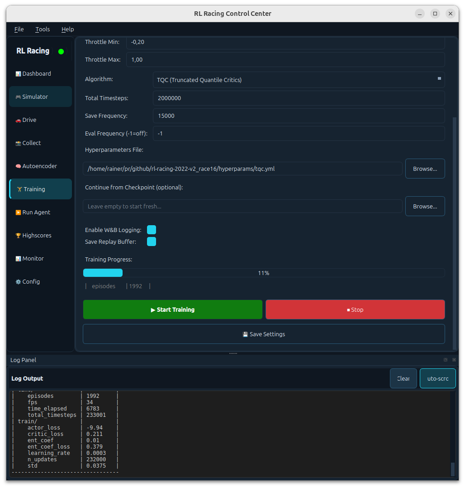

# RL Racing GUI (rl-baselines3-zoo)


A standalone PyQt6 GUI for [RL Baselines3 Zoo](https://github.com/DLR-RM/rl-baselines3-zoo). This tool provides a user-friendly interface for training, evaluating, and visualizing reinforcement learning agents, specifically tailored for racing environments like `donkeycar`.



> **⚠️ Status: Alpha / Work in Progress**
> 
> This GUI has been recently extracted from a larger monorepo and adapted to work as a standalone tool. It has not yet been fully tested in isolation. You may encounter bugs or missing dependencies. Please report any issues you find.
> Some features (like Autoencoder training visualization) are currently placeholders or undergoing repair.

> [!IMPORTANT]
> Versioning follows Semantic Versioning (MAJOR.MINOR.PATCH). See the [changelog](CHANGELOG.md) for release notes and upgrade notes.

### Quick Quality Checks (colored boxes)
<div style="display:flex; gap:10px; flex-wrap:wrap;">
  <div style="background:#e8f5e9; border-left:6px solid #2e7d32; padding:10px 12px; border-radius:6px;">
    <strong>Syntax lint (fast):</strong> <code>python -m compileall gui</code>
  </div>
  <div style="background:#e3f2fd; border-left:6px solid #1565c0; padding:10px 12px; border-radius:6px;">
    <strong>Smoke test:</strong> <code>python gui/main.py</code>
  </div>
</div>

## Features
- **Training Control**: Configure items like algorithm (PPO, SAC, TQC, TD3), hyperparameters, and environment settings.
- **Visual Feedback**: Real-time plotting of training metrics (Reward, Episode Length).
- **Enjoy Mode**: Run trained agents with easy checkpoint selection.
- **Process Management**: Start/Stop training and evaluation processes comfortably.

## Prerequisites
- Python **3.8+**
- System packages (for Box2D/PyGame support):
  - `ffmpeg`
  - `swig`
  - `cmake`
  
On Debian/Ubuntu:
```bash
sudo apt-get update
sudo apt-get install -y ffmpeg swig cmake
```

## Installation

### Option A: Conda (Recommended)
This approach automatically installs system dependencies like `swig` and `ffmpeg`.

1. **Clone this repository**:
   ```bash
   git clone https://github.com/Heavy02011/rl-baselines3-zoo-gui.git
   cd rl-baselines3-zoo-gui
   ```

2. **Create the environment**:
   ```bash
   conda env create -f environment.yml
   ```

3. **Activate the environment**:
   ```bash
   conda activate rl_zoo_gui
   ```

### Option B: PIP
If you prefer standard python:

1. **Clone this repository**:
   ```bash
   git clone https://github.com/Heavy02011/rl-baselines3-zoo-gui.git
   cd rl-baselines3-zoo-gui
   ```

2. **Create a virtual environment**:
   ```bash
   python -m venv .venv
   source .venv/bin/activate  # Linux/Mac
   # .venv\Scripts\activate  # Windows
   ```

3. **Install dependencies**:
   ```bash
   pip install -r requirements.txt
   ```

## Usage

### Running the GUI
Run the main entry point:
```bash
python gui/main.py
```

### Training
- Navigate to the **RL Training** tab.
- Select your Environment and Algorithm.
- Click **Start Training**.
- The GUI will execute `rl-baselines3-zoo` training. 
  - If `scripts/train.py` exists in the repo root (e.g. if you copied this GUI into a Zoo clone), it will be used.
  - Otherwise, it falls back to the installed `rl_zoo3.train` module.

### Enjoy (Evaluation)
- Navigate to the **Run Agent** tab.
- Select the algorithm and environment.
- Choose a trained model from the dropdown (scans `logs/` directory).
- Click **Run Agent**.

## Directory Structure
- `gui/`: Application source code.
- `logs/`: default location where training logs are stored (created automatically).
- `hyperparams/`: (Optional) Custom hyperparameter configuration files.

## License
MIT License. See [LICENSE](LICENSE) for details.
